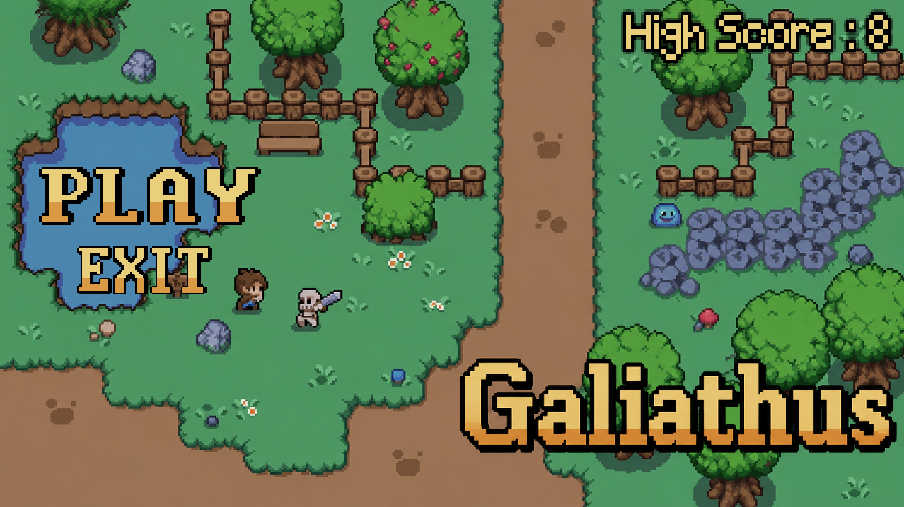
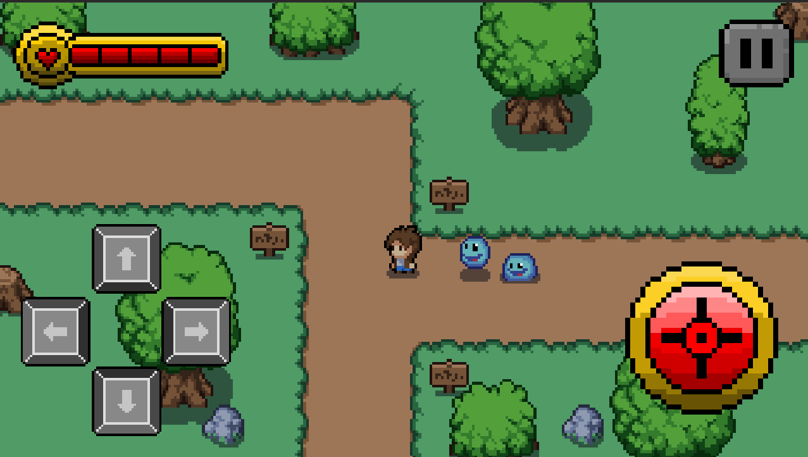
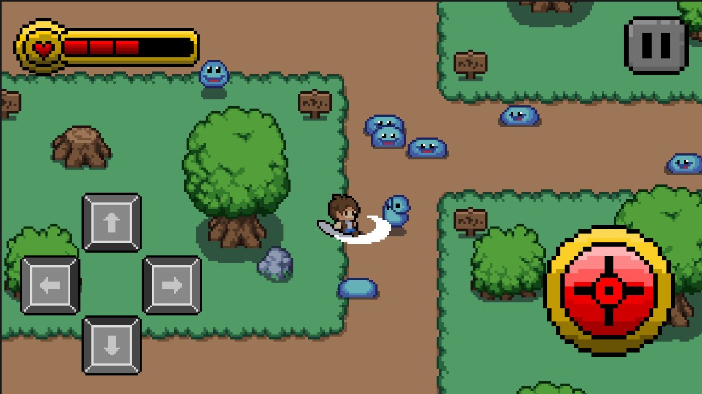
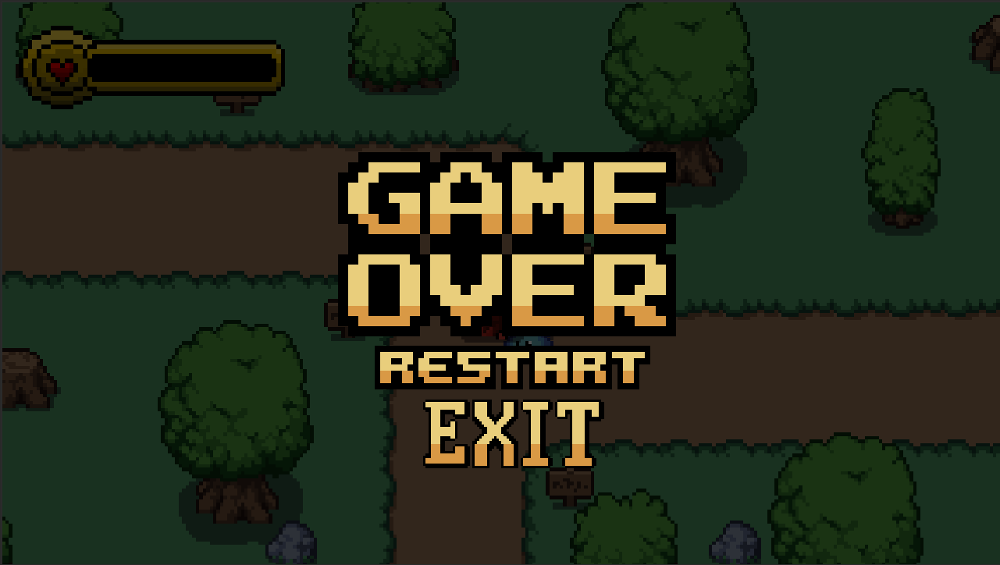

# Galiathus-Game-2D-Survival-Pixel
A 2D survival pixel-art game built using Godot Engine for Android.

---

## 🎮 About the Game
Survive endless waves of slimes, fight enemies, and try to get the highest score possible.

---

## ✨ Features
- Wave-based enemy system
- Mobile controls (joystick + buttons)
- HP system
- Attack system
- Sound effects
- Main menu + game over system

---

## 📸 Screenshots

### Main Menu

### GamePlay

### GameOver

---

## 📱 Platform
Android (APK)

---

## 🧠 Engine
Godot Engine 4

---

## 📦 Credits
- Mystic Woods by Game Endeavor  
https://game-endeavor.itch.io/mystic-woods

---

## 🔗 Play Game
https://byken.itch.io/galiathus
